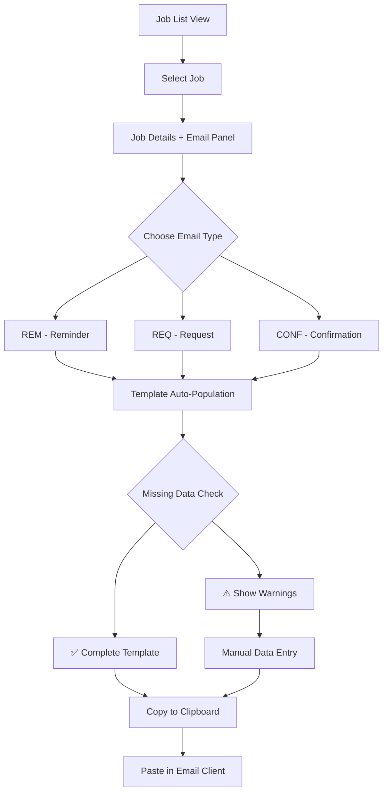

# Interlingo Email Draft Interface - Visual Journey

## Interface Flow Diagram



## Interface Layout Concept

### Split View Design:
```
┌──────────────────────────────────────┬────────────┐
│ [Spanish] Elena In-Person            │ REQ  CONF  │
│───────────────────────────────────────│────────────│
│ JOB INFORMATION                       │  REM       │
│ Date, Time, Org, Modality, Location  │            │
│                                       │  [Email    │
│ CLIENT REQUESTS                       │   Preview] │
│ [Case #, Client, Charges, Type]      │            │
│                                       │  [Copy]    │
│ INTERPRETER ASSIGNMENT                │  [Edit]    │
│ [Dropdown with conflict detection]   │  [Mark     │
│ Email/Phone with copy buttons        │   Sent]    │
│                                       │            │
│ NOT AVAILABLE                         │            │
│ [List of unavailable interpreters]   │            │
│                                       │            │
│ NOTES                                 │            │
│ [Internal notes area]                 │            │
│                                       │            │
│ VERSION HISTORY                       │            │
│ [Change log]                          │            │
└──────────────────────────────────────┴────────────┘
```

## Benefits of This Design:
- **Context Preservation**: Job details remain visible
- **Efficient Workflow**: No page switching required
- **Real-time Updates**: Changes to job data immediately reflect in email
- **Error Prevention**: Missing data warnings prevent incomplete emails

## Technical Implementation Notes:
- Side panel slides in when "Draft Email" button clicked
- Template selection triggers immediate re-render
- Missing data warnings update in real-time
- Copy button provides user feedback on success

---
*This unified interface eliminates the need for separate email tools while maintaining the context needed for accurate communication.*

Using MCP_Docker Obsidian find the following page INCOME/intercom/App - Interlingo/Interlingo-design-system.html all of the styling for the layouts, margins, and card components that should be on every page. Try it first for the dashboard.